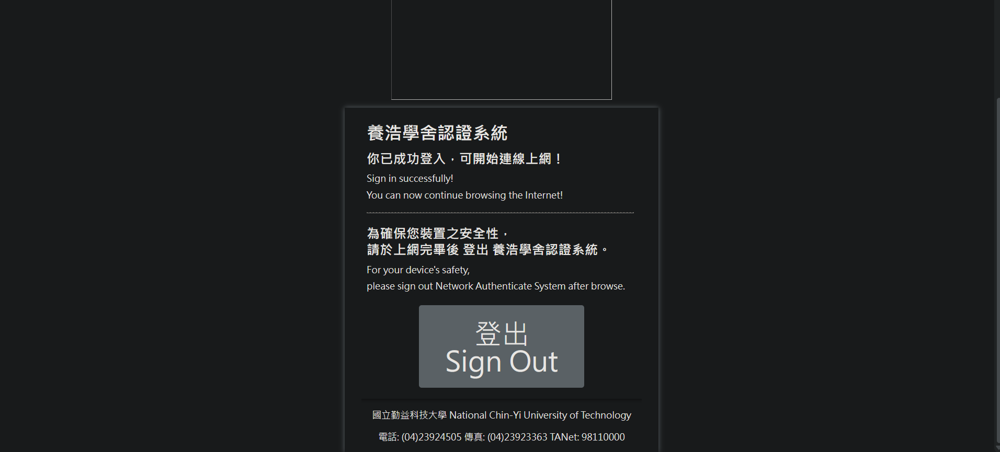

# 國立勤益科技大學校內網路自動連接腳本 
# NUCT WAL auto connector

國立勤益科技大學，全自動連接網路腳本，簡單安全開源程式碼，沒有任何技術專利，請安心使用。  

> 2024/04/08 啟用維護，參見[日誌](#日誌)。

---

## 目錄
- [全版本總覽](#全版本總覽)
- [開發環境](#開發環境)
- [如何執行](#如何執行)
- [版本差異](#版本差異)
- [日誌](#日誌)
- [貢獻](#貢獻)
- [著作權](#著作權)

---

## 開發環境

- Windows Home 11
- Python `3.7.0`
- requests `2.31.0`
- urllib3 `1.26.6`
- selenium `4.5.0`
- Chrome Version `114.0.5735`.199 (`Official Build`) (64-bit)

---

## 如何執行

步驟 一：如果沒有安裝 `Python` 請先[安裝](https://www.python.org/downloads/)，版本大於 `>= 3.7.0`。  

快速安裝步驟：可以利用以下指令快速安裝相依套件

```bash
pip install -r requirements.txt
```

步驟 二：使用 `selenium` 視覺化爬蟲模組（使用版本 `4.5.0`）。  

```bash
pip install selenium==4.5.0
```
> 備註：簡單方便輸入帳號密碼和送出表單。

步驟 三：安裝相依模組（`requests`、`subprocess`）。  

```bash
pip install requests
```
> 備註：檢測網路連線和獲得 HTTP 代碼。

```bash
pip install subprocess
```
> 備註：獲得網路登入介面內網 IP 位置。（如果找不到套件可不安裝）


步驟 四：`ssl` 的版本與 `urllib3` 不相容，[參見議題](https://stackoverflow.com/questions/76187256/importerror-urllib3-v2-0-only-supports-openssl-1-1-1-currently-the-ssl-modu)。  

```bash
pip install urllib3==1.26.6
```

步驟 五（非必須）：下載你所要開啟登入頁面的瀏覽器（推薦用Chrome，**驅動版本要與瀏覽器版本相符**）。

| 版本 | 描述 |
| ---- | ---- |
| Chrome | https://chromedriver.chromium.org/downloads |
| Firefox | https://github.com/mozilla/geckodriver/releases |
  
步驟 六：啟動腳本。
- 網路登入提示

- 網路登入頁面

- 網路登入成功

- 程式執行視窗


- 1. 可以直接點擊 `auto-reconnect_v5.py`  

- 2. 或是在程式資料夾內開啟終端機，並輸入以下指令
        ```bash
        python auto-reconnect_v5.py
        ```

大功告成！它會自動無窮執行。  
當你網路斷線，它會自動重新連線，過程非常快，不會有斷網的感覺，24/7執行。  
使用到的記憶體跟效能非常少，目前測試最高紀錄已經運行300小時了。

---

## 版本差異

| 版本 | 描述 |
| ---- | ---- |
| v1 | 使用 `requests` 完成動作，不過礙於不知道如何輸入帳密和送出，因此作罷失敗。 |
| v2 | 以後版本使用 `selenium` 完成動作，添加必要中文提示詞與排除非預期錯誤。 |
| v3 | 同上，英文提示詞（避免顯示編碼問題）與排除非預期錯誤，增加計時功能與完善非預期狀況。 |
| v4 | 由於需長時間執行，需完善所有非預期狀況。 |
| v5 | 只需具備 `Python` 便可執行檔案，自動下載所需模組和自動修復錯誤。需要注意 `Chrome` 版本，如果沒有重度依賴 `Chrome`，則可以考慮安裝特定版本（請從官方管道下載，小心病毒）。 |
| v6.beta | 輕量化中文檔案 |
| v7.beta | 使用 `Pyinstaller` 打包成 `.exe` |

---

## 日誌

| 時間 | 事件 |
| ---- | ---- |
| 2024/03/04 | `selenium` 不支持 `Chrome v120` 以上版本，手賤更新到了內核，不能執行，暫停維護。 |
| 2024/04/08 | 更改 `Chrome` 內核版本。 |
| 2024/04/08 | 重新開始維護！ |

---

## 貢獻

都是自己寫的，哈哈，這頗簡單ㄚ。  
可以輸入自己的帳號密碼，或是用學校公用的帳密。

---

## 著作權

此專案受到 [GPL-3.0](https://www.gnu.org/licenses/gpl-3.0.zh-tw.html) 保障。  
Copyright © 2023-2024 zong zong ( zongzong0408 )